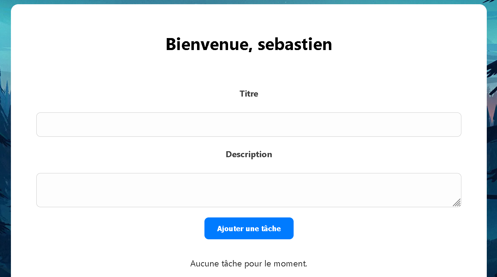

# Gestion de tâches (Task Manager MVC)

## Description
**FR :** Une application MVC en PHP orienté objet (POO) permettant à chaque utilisateur de gérer sa liste de tâches. L’accès est protégé : il faut être connecté, et chaque utilisateur ne voit que ses propres tâches.  
  
**EN :** An object-oriented PHP MVC application that allows each user to manage their task list. Access is protected: users must be logged in, and each user only sees their own tasks.

---
## Demo video - Creation/Connexion
<p align="center">
    
</p>


## Page Connexion


## Fonctionnalités / Features
**FR :**  
- Authentification simple (login/logout)  
- Création, modification et suppression de tâches  

**EN :**  
- Simple authentication (login/logout)  
- Creation, editing, and deletion of tasks  

---

## Prérequis / Requirements
**FR :**  
- PHP ≥ 7.4  
- MySQL (ou MariaDB)  
- Serveur web (Apache, Nginx…) avec support PHP  
- PHPMyAdmin avec interface graphique  
- Extension PDO pour MySQL activée  

**EN :**  
- PHP ≥ 7.4  
- MySQL (or MariaDB)  
- Web server (Apache, Nginx…) with PHP support  
- PHPMyAdmin with graphical interface  
- PDO extension for MySQL enabled  

---

## Installation / Installation

**FR :**  
1. Cloner le dépôt  
   ```bash
   git clone https://github.com/schatel-dev/Gestion-de-taches-PHP-MVC.git
   ```
2. Créer la base de données  
   ```sql
   CREATE DATABASE `taches_sech` CHARACTER SET utf8mb4 COLLATE utf8mb4_unicode_ci;
   USE `taches_sech`;

   CREATE TABLE `utilisateurs` (
     `id` INT AUTO_INCREMENT PRIMARY KEY,
     `login` VARCHAR(50) NOT NULL UNIQUE,
     `password` VARCHAR(255) NOT NULL
   );

   CREATE TABLE `taches` (
     `id` INT AUTO_INCREMENT PRIMARY KEY,
     `titre` VARCHAR(255) NOT NULL,
     `description` TEXT,
     `user_id` INT NOT NULL
   );
   ```
3. Configurer la connexion  
   - Ouvrir `library/init.php`  
   - Remplacer les valeurs d’hôte, nom de base, utilisateur et mot de passe par vos propres variables.

4. Déployer sur votre serveur  
   - Déployer les fichiers du projet sur votre serveur et vérifier si les services Web sont actifs.

5. Navigation sur le site  
   - Pour naviguer sur le site, commencez obligatoirement par le fichier `controleur_accueil.php`.

---

**EN :**  
1. Clone the repository  
   ```bash
   git clone https://github.com/schatel-dev/Gestion-de-taches-PHP-MVC.git
   ```
2. Create the database  
   ```sql
   CREATE DATABASE `taches_sech` CHARACTER SET utf8mb4 COLLATE utf8mb4_unicode_ci;
   USE `taches_sech`;

   CREATE TABLE `utilisateurs` (
     `id` INT AUTO_INCREMENT PRIMARY KEY,
     `login` VARCHAR(50) NOT NULL UNIQUE,
     `password` VARCHAR(255) NOT NULL
   );

   CREATE TABLE `taches` (
     `id` INT AUTO_INCREMENT PRIMARY KEY,
     `titre` VARCHAR(255) NOT NULL,
     `description` TEXT,
     `user_id` INT NOT NULL
   );
   ```
3. Configure the connection  
   - Open `library/init.php`  
   - Replace the host, database name, username, and password values with your own variables.

4. Deploy to your server  
   - Upload the project files to your server and ensure web services are running.

5. Navigate the site  
   - To browse the site, you must start at the `controleur_accueil.php` file.

---

## Usage / Usage
**FR :**  
1. Ouvrir votre navigateur et aller à l’adresse de votre serveur (ex. `http://localhost/controleur_accueil.php`).  
2. Se connecter (créer un compte dans la table `utilisateurs` si nécessaire) ou utiliser le formulaire. 



3. Gérer vos tâches : créer, modifier, supprimer.  

**EN :**  
1. Open your browser and navigate to your server's address (e.g., `http://localhost/controleur_accueil.php`).  
2. Log in (create an account in the `utilisateurs` table if needed) or use the login form.  
3. Manage your tasks: create, edit, delete.  

---

## Personnalisation / Customization
**FR :**  
- **Styles CSS** : `css/style.css`  
- **Templates** : modifier les vues dans `template/fragment` ou `template/pages`  
- **Helpers** : ajouter des méthodes utilitaires dans `model`  

**EN :**  
- **CSS styles**: `css/style.css`  
- **Templates**: modify views in `template/fragment` or `template/pages`  
- **Helpers**: add utility methods in `model`  

---

## 👤 Auteur | Author

**Sebastien C.**  
🎓 Promo 2025  
🔗 GitHub : [@schatel-dev](https://github.com/schatel-dev)

---

## 🌟 Support

🇫🇷 Si ce projet vous a été utile, pensez à lui attribuer une **étoile ⭐**.  
🇬🇧 If this project helped you, feel free to give it a **⭐**.

---

## Licence / License  
**FR :** Ce projet est libre, vous pouvez le modifier et le redistribuer selon vos besoins.  
**EN :** This project is open-source; you may modify and redistribute it as needed.
